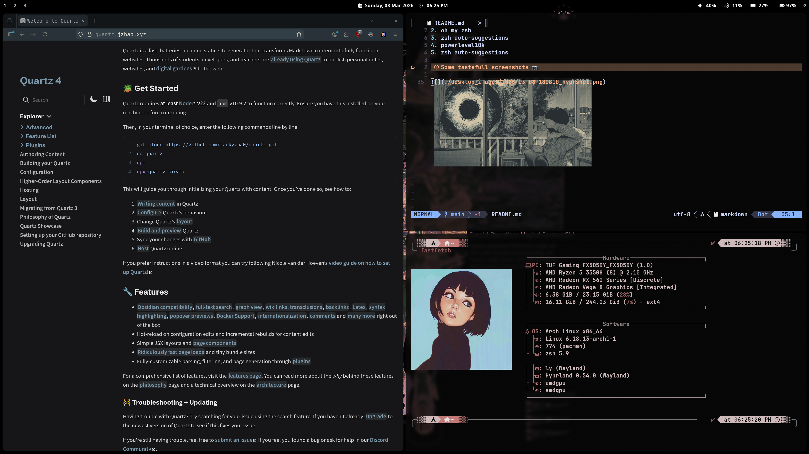

# ArchLinuxConfigs
My Arch Linux Configs

## Installation

Just run my installer and it will handle it

```bash
./Arch_linux_config_installer.sh
```


## What is use 

1. hyprland as my desktop environment 
2. hyprlock to lock desktop
3. Neovim to edit files 
4. I have made a change wallpaper script using swww and pywal 16-bit colors 

Incase you want check this out 

1. <a href="https://github.com/LGFae/swww">Swww</a>
2. <a href="https://www.youtube.com/watch?v=_xKIVzZAaGM">Pywal 16 bit color video</a> 

For Terminal i use 

1. zsh 
2. oh my zsh 
3. zsh auto-suggestions 
4. powerlevel10k 
5. zsh auto-suggestions

## Some tastefull screenshots 📷   



